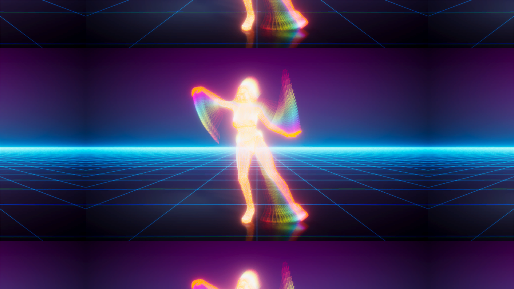

# CenterScaleTexture

A simple but useful snippet to apply UV space centered scaling to a texture in Unity.
This can be handy in menu backgrounds and in some other use-cases, if you don't want to touch the actual game objects.

### shader in action

